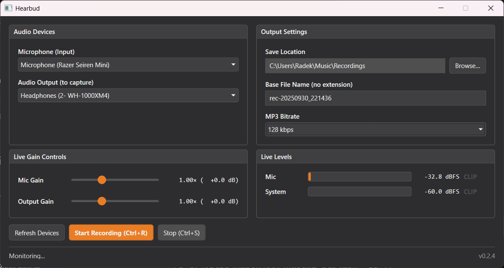

# Hearbud

Record your PC’s **system audio (WASAPI loopback)** and your **microphone** at the same time, with live meters, adjustable gains, and one-click export to **MP3**. Built for meetings, streams, and quick captures - inspired by the classic “earbud taped to the mic” hack, but without the tape. 😉



## Highlights

- **Loopback + Mic** captured in sync  
  - Writes three parallel WAVs during capture:
    - `*-system.wav` (raw system/loopback)
    - `*-mic.wav` (raw microphone, auto-converted to match loopback format)
    - `*-mix.wav` (system + mic averaged mix, headroom preserved)
  - After stop, the mix is encoded to `*.mp3`.

- **Quality-focused pipeline**
  - Mix WAV is **32-bit PCM** (configurable) to avoid an extra 16-bit quantization step before MP3.
  - **Soft clipping** (tanh) on the mix prevents harsh distortion if gains are pushed.
  - **TPDF dither** applied when writing 16-bit PCM (mic/system WAVs) to reduce low-level crunch.

- **Smart alignment**
  - Loopback is the **clock source**. Mic is buffered in a ring and pulled to match loopback chunks.
  - If loopback goes silent (e.g., mic-only speaking), files still roll: system = zeros, mix = mic-only.
  - When loopback resumes, stale mic backlog is **dropped**, so you don’t hear old mic over new system.

- **Live meters & gains**
  - Smooth, throttled (~20 Hz) UI level updates with **RMS + Peak** and clip flashes.
  - Independent **Mic** and **System** gains affect both meters and mix balance.

- **Ergonomics**
  - **MP3 bitrate selector** in the Output Settings (96–320 kbps).
  - Non-clobbering filenames (`foo (1).wav`, `foo (2).mp3`, etc.).
  - Session log (`*.txt`) written next to outputs; per-block diagnostics include ring underruns and effective mic backlog (latency) snapshots.
  - **Ctrl+R** to start, **Ctrl+S** to stop.

---

## Requirements

- **Windows** (WASAPI loopback)
- **.NET 8 SDK**
- **CSCore** (NuGet restored automatically)

---

## Build & Run

### Development (run locally)

```bash
dotnet restore
dotnet run --project Hearbud/Hearbud.csproj
```

### Production Build (for distribution)

Build standalone executables for both x64 and ARM64 Windows:

```bash
# Build for x64 Windows (most common)
dotnet publish -c Release -r win-x64 --self-contained -p:PublishSingleFile=true

# Build for ARM64 Windows
dotnet publish -c Release -r win-arm64 --self-contained -p:PublishSingleFile=true
```

**Output locations:**
- x64: `Hearbud/bin/Release/net8.0-windows/win-x64/publish/Hearbud.exe`
- ARM64: `Hearbud/bin/Release/net8.0-windows/win-arm64/publish/Hearbud.exe`

**Notes:**
- `--self-contained` includes .NET runtime (no installation required for users)
- `-p:PublishSingleFile=true` creates a single .exe file
- Distribute both versions if you want to support all Windows architectures
